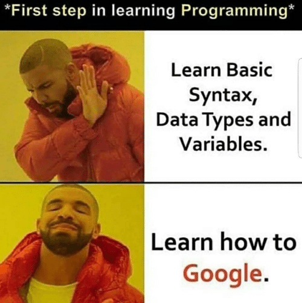

---
output:
  xaringan::moon_reader:
    seal: false
    lib_dir: libs
    css: 
      - default
      - my-theme.css
      - "https://cdnjs.cloudflare.com/ajax/libs/animate.css/3.7.0/animate.min.css"
    nature:
      highlightStyle: github
      beforeInit: "https://platform.twitter.com/widgets.js"
      highlightLines: true
      highlightSpans: false
      ratio: 16:9
      countIncrementalSlides: false
      slideNumberFormat: "%current%"
params:
  memes: true
  ani: false
---
```{r, include=FALSE}
options(readr.num_columns = 0)
knitr::opts_chunk$set(echo = TRUE, warning = FALSE, message = FALSE)
library(countdown)
```

name: title_slide
class: middle, title-slide, animated, fadeIn, faster, left
<link rel="stylesheet" href="https://use.fontawesome.com/releases/v5.7.2/css/all.css" integrity="sha384-fnmOCqbTlWIlj8LyTjo7mOUStjsKC4pOpQbqyi7RrhN7udi9RwhKkMHpvLbHG9Sr" crossorigin="anonymous">

<div class="my-footer"></div>

# Data Import and Cleaning in R
<br>
### .title-font[R Community of Practice]
#### .title-font[Centre for Global Health Research]
<br>
.title-font[.red[**<i>June 7th 2019</i>**]]
<br>
<br>
#### .title-font[.large[Eugene Joh]]

<h4><i class="fab fa-github fa-lg"></i> .title-font[&nbsp;@eugejoh]</h4>
<h4><i class="fab fa-twitter fa-lg"></i> .title-font[&nbsp;@CGHR_org]</h4>  

???

---
name: intro
class: animated, fadeIn, faster


.pull-left[
## Today's Session
<br>
### Outline: 

{{content}}
]

--

 - Data Structures (5 minutes)  
 - Interactive Tutorial (40-45 minutes)  
 - Useful Resources (5 minutes)  
 
{{content}}
--
<br>

### Learning Objectives:
{{content}}

--
 1. Describe R data types and data structures  
 2. Import CSV files into R  
 3. Perform basic data cleaning using R  

--

.pull-right[
<br>
<br>
<center>
```{r echo=FALSE, out.width = "350px", eval=params$memes, eval=FALSE}

```
</center>
]

---
name: data structures
class: animated, fadeIn, faster, title-slide, inverse, middle

# Data Types and Structures


---
class: animated, fadeIn, faster

<br>
.pull-left[
### Data Types:
 - Numeric  
 - Integer  
 - Character  
 - Logical  
 - Factor*

.small[*technically an attribute]
{{content}}
]

--

```{r}
dbl_var <- c(1, 2.5, 4.5)
# L suffix = an integer rather than a double
int_var <- c(1L, 6L, 10L)
# TRUE and FALSE (or T and F)
log_var <- c(TRUE, FALSE, T, F)
chr_var <- c("these are", "some strings")

# examples taken from Advanced R book
```
{{content}}

--

--

.pull-right[
### Data Structures:


.small[*Information on selecting elements see [Advanced R: Subsetting](http://adv-r.had.co.nz/Subsetting.html)*]
]

---
name: interactive_tutorial
class: animated, fadeIn, faster, title-slide, inverse, middle

# Interactive Tutorial

---
name: tut_getting_started
class: animated, fadeIn, faster

## Getting Started
<br>

--
 1. Find a friend for this session  

--

 2. R and RStudio are installed and working, if not...  
 
   - Download R: [http://www.r-project.org/](http://www.r-project.org/)  
   - Download RStudio, the R IDE: [http://www.rstudio.com/](http://www.rstudio.com/)

--

 3. Download zip file with material (R Project folder)  
   - Link: [http://bit.ly/2XcH8Ac](http://bit.ly/2XcH8Ac) *remember where you saved it!*  

--

 4. Unzip the file and open the project either by...
   - Open the `.Rproj` file
   - Click *Open Project* in top-right corner of RStudio   

---
name: openR
class: animated, zoomIn, faster, title-slide, inverse, middle

# Let's Get Started!

```{r twee_fnc, include=FALSE}
twee <- function(path = getwd(), level = Inf) {
  
  fad <-
    list.files(path = path, recursive = TRUE,no.. = TRUE, include.dirs = TRUE)

  fad_split_up <- strsplit(fad, "/")

  too_deep <- lapply(fad_split_up, length) > level
  fad_split_up[too_deep] <- NULL
  
  jfun <- function(x) {
    n <- length(x)
    if(n > 1)
      x[n - 1] <- "|__"
    if(n > 2)
      x[1:(n - 2)] <- "   "
    x <- if(n == 1) c("-- ", x) else c("   ", x)
    x
  }
  fad_subbed_out <- lapply(fad_split_up, jfun)
  
  cat(unlist(lapply(fad_subbed_out, paste, collapse = "")), sep = "\n")
}
```

---
name: start
class: animated, fadeIn, faster

## Open RStudio
<br>
#### Steps:  
 1. Identify the four IDE Panels  
 2. Browse `messy_data_tutorial` project folder  
 3. Create a new R script and save it in the project folder  

<br>
```{r eval=FALSE, echo=FALSE}
cat("|messy_data_tutorial")
twee("/Users/eugenejoh/GitHub/messy_data_tutorial/")0
```

---
name: data_import
class: animated, fadeIn, faster

## Data Import
<br>
#### Steps:  
 1. Load packages  
 2. Identify file path for data (.csv files)  
 3. Import the .csv files into R  
 4. Assign imported .csv files as `data1`, `data2`, `data3`  
 5. View content in data frames

--
<br>
<br>

#### Useful Functions:  
 - `library()`
 - `list.files()`, `getwd()`, `here()`  
 - `read_csv()`, `read_delim()`  
 - `head()`, `tail()`, `glimpse()`, `summary()`  

---
name: tasks
class: animated, fadeIn, faster

.pull-left[
## Interactive Coding
<br>

{{content}}

]

--

#### Format:

 - **Example** of a task using `data1.csv`  

 - **Your turn** to apply similar task on `data2.csv`  

 - Try a function -> run the code -> see the output  
 
{{content}}
--

<br>

#### Tips:

 - Use <b>Google, StackOverflow, Forums, etc.</b>  
 
 - Use `?` or `??` in the console to open <b>R Documentation</b>  
 
{{content}}
--

--

.pull-right[
<br>
<center>
```{r echo=FALSE, out.width = "400px", eval=TRUE}
knitr::include_graphics("img/orly.jpg")
```
</center>

]

---
name: task1
class: animated, fadeIn, faster, middle

## Task 1:
<br>
#### Convert `age` to an integer type as a new variable `age_int`
<br>

```{r echo=FALSE}
countdown(minutes = 3, seconds = 0, 
          left = 0, right = 0,
          bottom = 0,
          padding = "15px",
          margin = "5%",
          font_size = "2em", 
          play_sound = TRUE,
          color_running_background = "green")
```

---
name: task2
class: animated, fadeIn, faster, middle

## Task 2:
<br>
#### Keep all observations when there is a missing value for `immune_status`
<br>

```{r echo=FALSE}
countdown(minutes = 3, seconds = 0, 
          left = 0, right = 0,
          bottom = 0,
          padding = "15px",
          margin = "5%",
          font_size = "2em", 
          play_sound = TRUE,
          color_running_background = "green")
```

---
name: task3
class: animated, fadeIn, faster, middle

## Task 3:
<br>
#### Separate `area` into new variables called `location` and `city`
<br>

```{r echo=FALSE}
countdown(minutes = 3, seconds = 0, 
          left = 0, right = 0,
          bottom = 0,
          padding = "15px",
          margin = "5%",
          font_size = "2em", 
          play_sound = TRUE,
          color_running_background = "green")
```


---
name: task4
class: animated, fadeIn, faster, middle

## Task 4:
<br>
#### Create a binary variable for `5-9` and Not `5-9` age groups 
<br>

```{r echo=FALSE}
countdown(minutes = 4, seconds = 0, 
          left = 0, right = 0,
          bottom = 0,
          padding = "15px",
          margin = "5%",
          font_size = "2em", 
          play_sound = TRUE,
          color_running_background = "green")
```

---
name: task5
class: animated, fadeIn, faster, middle

## Task 5:
<br>
#### Standardize sex variable to `male` and `female` .small[ *hint: use `case_when()`*]
<br>

```{r echo=FALSE}
countdown(minutes = 5, seconds = 0, 
          left = 0, right = 0,
          bottom = 0,
          padding = "15px",
          margin = "5%",
          font_size = "2em", 
          play_sound = TRUE,
          color_running_background = "green")
```

---
name: task5
class: animated, fadeIn, faster, middle
exclude: no

## Comprehensive Exercise:
<br>
#### 1. Create a new numeric variable for the serum IgM value  
#### 2. Separate units (mg, dL) into two new variables (numerator, denominator)  
#### 3. Create categorical variable for low/high serum IgM (high is greater or equal to 200mg/dL)  
<br>

```{r echo=FALSE}
countdown(minutes = 10, seconds = 0, 
          left = 0, right = 0,
          bottom = 0,
          padding = "15px",
          margin = "5%",
          font_size = "2em", 
          play_sound = TRUE,
          color_running_background = "green")
```

---
name: resources
class: animated, fadeIn, faster, title-slide, inverse, middle

# Resources 

---
name: resources
class: animated, fadeIn, faster
exclude: false

## Data Types and Data Structures
<br>

.pull-left[
#### Starting Points:
 - [Base R Cheatsheet (p. 2)](https://www.rstudio.com/wp-content/uploads/2016/05/base-r.pdf)  
 - [R for Data Science: Vectors Chapter](https://r4ds.had.co.nz/vectors.html)  
<br>
<center>
```{r echo=FALSE, out.width = "220px"}
knitr::include_graphics("https://d33wubrfki0l68.cloudfront.net/b88ef926a004b0fce72b2526b0b5c4413666a4cb/24a30/cover.png")
```

</center>
]

.pull-right[
#### Deeper Dive:
 - [Software Carpentry R Website](https://swcarpentry.github.io/r-novice-inflammation/13-supp-data-structures/)  
 - [Advanced R: Data Structures Chapter](http://adv-r.had.co.nz/Data-structures.html)   
<br>
<center>
```{r echo=FALSE, out.width = "220px"}
knitr::include_graphics("https://d33wubrfki0l68.cloudfront.net/565916198b0be51bf88b36f94b80c7ea67cafe7c/7f70b/cover.png")
```
</center>
]

---
name: data_import
class: animated, fadeIn, faster
exclude: false

## Data Import Packages
<br>
.pull-left[
#### Delimited Text:
 - `readr` [package](https://readr.tidyverse.org/) 
 - `fread()` from [`data.table` package](https://cran.r-project.org/web/packages/data.table/vignettes/datatable-intro.html)  


#### Excel:
 - `readxl` [package](https://readxl.tidyverse.org/)  
 - `xlsx` [package](http://www.sthda.com/english/wiki/r-xlsx-package-a-quick-start-guide-to-manipulate-excel-files-in-r)  
 - `openxlsx` [package](https://cran.r-project.org/web/packages/openxlsx/index.html)

 
#### SAS, SPSS, Stata, Minitab:
 - `haven` [package](https://haven.tidyverse.org/)  
 - `foreign` [package](https://cran.r-project.org/web/packages/foreign/index.html)  
]

.pull-right[

#### Databases (PostgreSQL, MySQL):
 - `DBI` [package](https://db.rstudio.com/dbi/)  
 - `Rpostgres` [package](https://github.com/r-dbi/RPostgres)  
 - `RMySql` [package](https://cran.r-project.org/web/packages/RMySQL/index.html)  
 - `RMariaDB` [package](https://cran.r-project.org/web/packages/RMariaDB/index.html)  
 
<br>

```{r echo=FALSE, out.width = "500px", fig.align='right'}
knitr::include_graphics("img/import.png")
```
]
