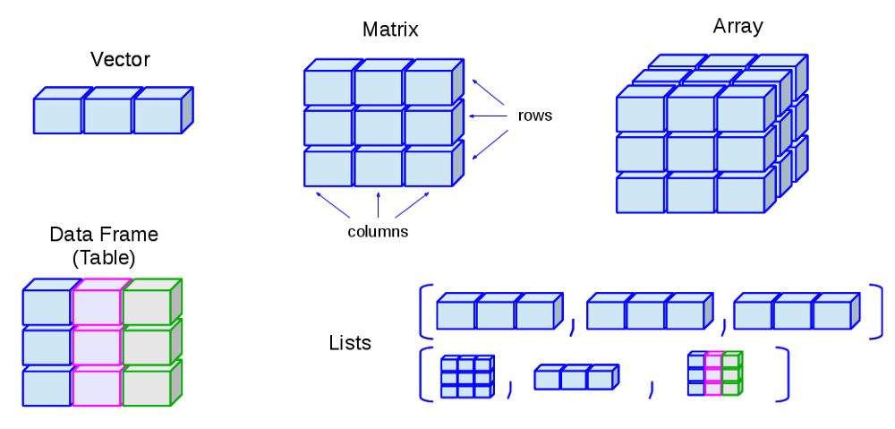

---
output:
  xaringan::moon_reader:
    seal: false
    lib_dir: libs
    css: 
      - default
      - my-theme.css
      # - "https://cdnjs.cloudflare.com/ajax/libs/animate.css/3.7.0/animate.min.css"
    nature:
      highlightStyle: github
      beforeInit: "https://platform.twitter.com/widgets.js"
      highlightLines: true
      highlightSpans: false
      ratio: 16:9
      countIncrementalSlides: false
      slideNumberFormat: "%current%"
params:
  memes: true
  ani: false
---
```{r, include=FALSE}
options(readr.num_columns = 0)
knitr::opts_chunk$set(echo = TRUE, warning = FALSE, message = FALSE)
```

name: title_slide
class: middle, title-slide, animated, fadeIn, faster

# R Community of Practice
## Centre for Global Health Research

#### 2019-06-06

<link rel="stylesheet" href="https://use.fontawesome.com/releases/v5.7.2/css/all.css" integrity="sha384-fnmOCqbTlWIlj8LyTjo7mOUStjsKC4pOpQbqyi7RrhN7udi9RwhKkMHpvLbHG9Sr" crossorigin="anonymous">

???

---
name: intro
class: animate, fadeIn, faster


.pull-left[
## Today's Session

**Outline:**

{{content}}
]

--

 - Data Structures (5 minutes)  
 - Interactive Tutorial (35-40 minutes)  
 - Practical Tips for Online Resources (5 minutes)  
 
{{content}}
--
<br>

**Learning Objectives:**
{{content}}

--
 1. Describe R data types and data structures  
 2. Import CSV files into R  
 3. Perform basic data cleaning using R  

--

.pull-right[
<br>
<center>
```{r echo=FALSE, out.width = "400px", eval=params$memes}
knitr::include_graphics("img/orly.jpg")
```
</center>
]

---
name: data structures
class: animate, fadeIn, faster, title-slide, inverse, middle

## Data Structures


---
class: animate, fadeIn, faster

## Data Structures

.pull-left[
.larger[**Data Types**]
 - Numeric  
 - Integer  
 - Character  
 - Logical  
 - Factor*

.small[*technically an attribute]
{{content}}
]

--

```{r}
dbl_var <- c(1, 2.5, 4.5)
# L suffix = an integer rather than a double
int_var <- c(1L, 6L, 10L)
# TRUE and FALSE (or T and F)
log_var <- c(TRUE, FALSE, T, F)
chr_var <- c("these are", "some strings")

# examples taken from Advanced R book
```
{{content}}

--

--

.pull-right[



.small[*Information on selecting elements see [Advanced R: Subsetting](http://adv-r.had.co.nz/Subsetting.html)*]
]

---
name: interactive_tutorial
class: animate, fadeIn, faster, title-slide, inverse, middle

## Interactive Tutorial

---
name: tut_getting_started
class: animate, fadeIn, faster

## Getting Started

 1. R and RStudio are installed and working  
 
   - Check R version by running `R.version.string` in your console  
   - If you are running R < 3.5.0 please [update](https://cloud.r-project.org/)!  

--

 2. Open .zip file containing files (data, R scripts) on the website  
   - Should be a folder with *cghr_tut1.Rproj*, *cghr_tut1.R*, and */data* folder  

--

 3. Open the project either by opening the `.Rproj` file or *Open Project* in top-right corner of RStudio   

---
name: resources
class: animate, fadeIn, faster
exclude: true

## Resources on Data Types and Data Structures

.pull-left[
#### Starting Points:
 - [Base R Cheatsheet (p. 2)](https://www.rstudio.com/wp-content/uploads/2016/05/base-r.pdf)  
 - [Quick-R](https://www.statmethods.net/input/datatypes.html)  

#### Deeper Dive: 
 - [Software Carpentry R Website](https://swcarpentry.github.io/r-novice-inflammation/13-supp-data-structures/)  

#### Even Deeper Dive:
 - [Advanced R: Data Structures](http://adv-r.had.co.nz/Data-structures.html)   
]