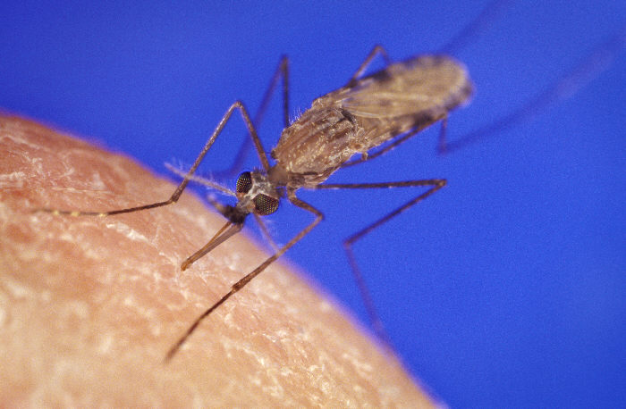

---
output:
  xaringan::moon_reader:
    seal: false
    lib_dir: libs
    css: 
      - default
      - my-theme.css
      # - "https://cdnjs.cloudflare.com/ajax/libs/animate.css/3.7.0/animate.min.css"
    nature:
      highlightStyle: github
      beforeInit: "https://platform.twitter.com/widgets.js"
      highlightLines: true
      highlightSpans: false
      ratio: 16:9
      countIncrementalSlides: false
      slideNumberFormat: "%current%"
params:
  memes: false
  ani: false
---
```{r, include=FALSE}
options(readr.num_columns = 0)
knitr::opts_chunk$set(echo = TRUE, warning = FALSE, message = FALSE)
```

name: title_slide
class: middle, title-slide, animated, fadeIn, faster

# R Tutorials and Community of Practice
## Centre for Global Health Research

#### 2019-05-02
<!-- 'r Sys.Date() -->

<!-- ### Eugene Joh -->

<link rel="stylesheet" href="https://use.fontawesome.com/releases/v5.7.2/css/all.css" integrity="sha384-fnmOCqbTlWIlj8LyTjo7mOUStjsKC4pOpQbqyi7RrhN7udi9RwhKkMHpvLbHG9Sr" crossorigin="anonymous">

???
Kick off first of (hopefully) more R and data-related tutorials. Looking at the title, but I think it will be more appropriate to call these "meeting" our community of practice. CoP is something I'll discuss a bit further today.

---
name: ej_intro
class: animated, fadeIn faster
exclude: true

## About Me

.pull-left[
**Background:**
 - MS/MPH (Environmental Health)  
 - Public Sector & Non-Profit

**CGHR Role:**
 - Data Management  
 - Data Analysis  

**Interests:**
 - Data Science + Public Health  
 - Vector-borne Diseases  
 - One Health  
 - Spatial Epidemiology  
]

.pull-right[
<br>
<center>
```{r echo=FALSE, out.width = "240px"}
knitr::include_graphics("https://avatars3.githubusercontent.com/u/24900779?s=460&v=4")
```
<br>
<span style="font-size:1em; color: #2D2D2D;">
<i class="fab fa-twitter fa-lg red"></i> <a href="https://twitter.com/eugejoh">eugejoh</a>
<br>
<i class="fab fa-github fa-lg red"></i> <a href="https://github.com/eugejoh">eugejoh</a>
</span>
<br> 
</center>
]

---
name: what_cop
class: animated, fadeIn, faster
<center><h2>What is a Community of Practice (CoP)?</h2></center>

<br>
<br>
<center><h3>Definition:</h3>

.large[<b>A group of people who share a craft or a profession</b><sup>1</sup>]</center>

.footnote[[1] Lave and Wegner, 1991]


???
By definition a CoP is ... they meet to engage with one another regarding this craft. With this group we'll be focusing on data analysis and the use of R for our team.

---
name: why_cop
class: animated, fadeIn, faster
## Why create a Community of Practice?

.pull-left[
<b>Environment for Sharing:</b>  
 - Useful tips  
 - Best practices  
 - Questions/Answers  

<b>Expectations:</b>  
 - Open and informal  
 - Ask questions  
 - Listen  
 - Respect everyone's contributions  
]

--
.pull-right[
<center>
<blockquote class="twitter-tweet" data-lang="en"><p lang="en" dir="ltr"><a href="https://twitter.com/allison_horst/status/1102447015248637953">11. February 2015</a></blockquote>
</center>


]
???
So you might ask, we call it a CoP or create one?

The bottom line is that these meetings will be a place where we can informally share useful information, ask and answer questions together (there is no such thing as a dumb question), basic respect for one another.

And the reason why I personally think that CoP are beneficial for a group is that there is power in collaboration and sharing of resources. 

It's not fun to learn how to code alone and this tweet from the R community on Twitter sums up what the learning process can look like and be. 

So this is an invitation to bring your questions and insights to these meetings!


---
name: objectives
class: animated, fadeIn, faster, middle

## CoP Structure

.large[
1. Meet for 50 minutes  
2. Presentation/tutorial of a useful tool (30min)  
3. Open discussion (20min)  
]


???
So for the future sessions, we'll try to meet for around an hour. 

The typical format will be an informal presentation by someone on a useful tip, tool, package, whatever it will be for 30 minutes

Then the rest of the time will be open discussion - people can bring questions, share ideas/functions/packages, discuss current data problems/concerns. 

This format is not concrete and we can play it by ear moving forward.

---
name: survey_title
class: animate, fadeIn, faster, title-slide, inverse, middle

## Google Survey Results

???
I sent out a Google survey on data software usage and specifically questions on the use of R at CGHR in February.

---
name: survey
class: animate, fadeIn, faster

## Google Survey (n=6)

**Excel, Stata,** and **R** top tools used for data related tasks!  

.pull-left[
**Top uses of R...**
 1. Data Visualization  
 2. Report Generation  

**Challenges...**
 1. R objects and class types  
 2. Navigate large number of packages  

]

.pull-right[
**Proficiency and Goals...**
 1. Data Analysis  
 2. Data Visualization  
 3. Vectorizing/Iterating Code  
 (loops, `apply` functions, `purrr` package)  

]

???
These were the results of the survey - N = 6. Excel, Stata and R were the most used tools for data related tasks. 

From the top uses, challenges, and goals - **data visualization** and **data analysis** were the most frequently mentioned.

---
name: game_plan
class: animate, fadeIn, faster

## Game Plan

Next two meetings will be tutorials on...  

 - .large[Data Visualization using `ggplot2`]  
 - .large[Vectorizing R Code (loops, `apply`, `purrr` package)]  

<br>
--
.pull-left[Today will be a presentation on...
 - .large[Data Workflow Walkthrough]  
 
Code and Slides: [**GitHub Page**](https://eugejoh.github.io/cghr_cop/)
]
--
.pull-right[
```{r echo=FALSE, eval=params$memes}
knitr::include_graphics("https://media.giphy.com/media/K72vGV2B0GC5y/giphy.gif")
```

]
???
The tutorials will be created to be within the context of CGHR and be (hopefully) useful for staff for their everyday.

Today I'll giving a presentation on data workflows and we'll be going through a simple data analysis from beginning to end!

The code and slides are available on GitHub, the link is here

---
name: tutorial_title
class: middle, title-slide, animated, fadeIn, faster

# Data Workflows

--

## Import, Process, Communicate

--
  
.small[*R for Data Science (Hadley Wickham & Garrett Grolemund)*]


???
You can generally break up a data workflow into separate categories

This frame work is really easy way to think about any research project

---
name: tutorial_subtitle
class: middle, title-slide, animated, fadeIn, faster
# Good Data Workflows

--
#### "Why should I care?"

--
## Reproducibility

--
## Repeatability

--
## Recall


???

So "good" data workflows... why should I care?
really, why should I care? This will save future headaches and allow you to better predict and debug errors with your code!

---
name: 
class: middle, title-slide, animated, fadeIn, faster
### "What are best practices?"  

--


---
name:
class: middle, title-slide, animated, fadeIn, faster

### "This is too time consuming!"

--


???
The authours recognized this as time is a precious commodity, and this article they wrote touches on the bare-minimum requirements to conduct scientific analysis well. I recommend reading this article!

---
class: animate, fadeIn, faster
exclude: true

## Common Types of Data in Epidemiology
.pull-left[
### Data Sources
 - Surveys, Censuses, Registers, etc.  
 - Medical/Hospital Records  
 - Surveillance/Disease Notification  
 
]

.pull-right[

### Data Structure
 - Tabular/rectangular structure
   - **Rows** (records, observations, tuples)  
   - **Columns** (variables, fields, attributes) 
]

---
class: animated, fadeIn, faster, middle, title-slide

# Walkthrough:

## Globally Reported Malaria Deaths

---
class: animated, fadeIn, faster

## Globally Reported Malaria Deaths

.pull-left[
**Research Question:**  
 - What are the national trends in malaria deaths that are reported to the WHO from 2007 to 2017 in Sierra Leone, Mozambique, Ethiopia, and India?  

**Data Source:** WHO Global Health Repository

**Details:**
 - Number of reported deaths per year  
 - Deaths in health facility  
 - From national malaria control programmes  
 - Unadjusted counts  


]
.pull-right[
<br>

<center>
```{r echo=FALSE, out.width = "400px"}

```
<br>
.small[*Anopheles gambiae*]</center>
]

???
https://ourworldindata.org/malaria#malaria-death-estimates-from-who


---
class: middle, title-slide, animate, fadeIn, faster

# Let's Get Started with Analysis!

---
class: middle, title-slide, animate, fadeIn, faster
```{r echo=FALSE, eval=params$memes}
knitr::include_graphics("https://media.giphy.com/media/3s39mJ7zXU94mfAq4W/giphy.gif")
```

???
but wait..

---
class: middle, title-slide, animate, fadeIn, faster

# Data Management

---
class: animated, fadeIn, faster

## Data Management

Document a **minimum amount** of information about our data

 1. Description  
 2. Source  
 3. Date Updated  
 4. Date Acquired  
 5. Person who obtained the data
 
<br>
 
--
This can all be stored in a **README** file or document

???
So data management is important because when you don't do it, it will bite you back in an year or two when you don't remember all the details regarding the data.

So following the "good enough" principles, we should be documenting these 5 things listed below.

brief description of the dataset
where you obtained the data, the source(website, MoU, collaborator)
how recent is the data or when was the last time the data were updated
when you actually obtained or downloaded the data
who actually got the data...

this can all be stored in a readme file or document

---
class: animated, fadeIn, faster

## README File

--
.pull-left[
**Description:**
 - Number of reported malaria deaths  
 - Deaths in health facility (presumed and confirmed)  
 - National malaria control programmes  
 - Unadjusted counts  

**Data Source:** [WHO Global Health Repository](http://apps.who.int/gho/data/node.main.A1367?lang=en) .small[http://apps.who.int/gho/data/node.main.A1367?lang=en]

**Last Updated:** 2017

**Date Acquired:** April 12, 2019

**Contact:** Eugene J
]
--

.pull-right[
<br>

<center>
```{r echo=FALSE, out.width = "400px", eval=params$memes}
knitr::include_graphics("img/sheep.gif")
```
<br>
]

???
So applying this for our malaria data

So now that we have the minimum amount of data documentation recorded, we are good to go

---
class: animate, fadeIn, faster, middle, title-slide

# Data Import

---
class: animate, fadeIn, faster
# Data Import
Questions to ask...  
- Where is the file? 
--
**"/01_data" Folder**
--

- What is the file type? 
--
**Comma delimited or .csv**
--

- How do I import this file type into R? 
--
**`read_csv()`**

--
```{r message=FALSE}
library(here)
library(readr)
```

```{r}
file_name <- "MALARIA001"
```
--
```{r}
the_file <- list.files(path = here::here("data"), 
                       pattern = paste0(file_name, "\\.csv"),
                       full.names = TRUE)
the_file
```
--
```{r}
my_data <- readr::read_csv(file = the_file, skip = 1)
```

---
class: animate, fadeIn, faster
highlightSpans: false
# Data Import

```{r}
head(my_data, 5)

dim(my_data)
```

---
class: animate, fadeIn, faster, middle, title-slide
# Data Processing

---
class: animate, fadeIn, faster
# Data Processing
### Objectives:
1. Reshape data from wide to long format  
2. Specify data types  
3. Filter for 2007 to 2017 period  
4. Filter for certain countries  

<br>
--
.large[How can we do this in R?] 
--
.large[**More packages!**]
--
```{r message=FALSE}
# part of the tidyverse
library(dplyr)
library(tidyr)
```

???
our objectives to answer the research question on the trends of malaria deaths, we can to do the following.

1. reshape the data... for those Stata users you are very aware of what this entails
2. specify data types if any are wrong
3. filter for the time period we were interested in
4. filter for the countries of interest

---
class: animate, fadeIn, faster
## 1. Reshape Data
We want to "gather" all the columns (2000, 2001, ..., 2017) into a single `Year` column
<br>
--
<br>
We can use `gather` from the `tidyr` package!
--
```{r}
l_data <- gather(my_data, "Year", "Deaths", -"Country")
```
--
```{r}
head(l_data, 3) #sanity check 1
dim(l_data) #old dim() was 105 19
```

???
check dims 18*105 = 1890

---
class: animate, fadeIn, faster
## 2. Data Types
First we'll check the data types for each column

--
```{r}
head(l_data, 3)
```

--

`Year` seems to be a `character` type, so we need to switch to `numeric` type...

---
class: animate, fadeIn, faster
## 2. Data Types

We want to "change" the `Year` column to a `numeric` data type
<br>
--
<br>
We can use `mutate` from the `dplyr` package!
--
```{r}
l_data <- mutate(l_data, Year = as.numeric(Year))
```
--
```{r}
head(l_data, 3)
```

???
if you notice we're assigning the output of the mutate to `l_data` again, this is just means that we're updating or reassigning `l_data` in our function.

we look at the `l_data` we just assigned and now it's a numeric "double" type

---
class: animate, fadeIn, faster
## 3. Filter Years
Next we want to "filter" years from 2007 and up
<br>
--
<br>
We can use `filter` from the `dplyr` package!
--
```{r}
range(l_data$Year) #range of years
```
--
```{r}
l_data <- filter(l_data, Year >= 2007)
```
--
```{r}
range(l_data$Year) #sanity check 2
```

???
the range in the original data is from 2000 to 2017

"we want to filter our data frame `l_data` for only years that are greater than or equal to 2007"

sanity check

---
class: animate, fadeIn, faster
## 4. Filter Countries
And finally "filter" the countries we want
--
```{r eval=FALSE}
l_data <- filter(l_data, Country == "Sierra Leone" & Country == "Mozambique" & Country == "Ethiopia" & Country == "India")
```
--
```{r}
my_countries <- c("Sierra Leone", "Mozambique", "Ethiopia", "India")
l_data <- filter(l_data, Country %in% my_countries)
```

--
```{r echo=FALSE}
l_data
```

???
we can declare the conditions for each country... you might think, this is cumbersome what if I wanted to filter for 20 countries?

we can do that creating a vector of countries we want called `my_countries` and we can use the %in% operator to return the same logic conditions as above to filter our data

---
class: animate, fadeIn, faster
## Chain Multiple Steps

You can chain all the processing together using the pipe operator `%>%`!
--
.pull-left[
```{r}
# with piping!
l_data_pipe <- my_data %>% 
  gather("Year", "Deaths", -"Country") %>% 
  mutate(Year = as.numeric(Year)) %>% 
  filter(Year >= 2007) %>% 
  filter(Country %in% my_countries)
```
```{r}
# `l_data` is the non-pipe method
identical(l_data, l_data_pipe)
```
]

???
so we accomplished all the processing in separate steps or lines of code. `dplyr` contains a pipe operator that allows to chain multiple functions together and make it really easy to write and read the code that does all the processing!

When I first learned about this, it literally blew my mind and has made it easier for me to read and understand my own code

--
.pull-right[
<br>
<center>
```{r echo=FALSE, out.width = "300px", eval=params$memes}

```
<br>
]

---
class: animate, fadeIn, faster, title-slide, middle
# Communication

???
final data workflow step is communication

---
class: animate, fadeIn, faster

## Data Visualization

.pull-left[
R has great built-in functionality and packages for creating plots:
 - Base R Graphics: [Introduction](https://rstudio-pubs-static.s3.amazonaws.com/7953_4e3efd5b9415444ca065b1167862c349.html)  
 - `ggplot2`: **Next session!**  
 - `plotly`: [Interactive visualizations](https://plot.ly/r/)   
 - `gganimate`: [Animations](https://github.com/thomasp85/gganimate#yet-another-example)

<br>
Other inspiration: [R-Graph Gallery](https://www.r-graph-gallery.com/)
]

--
.pull-right[
Hans Rosling: [Gapminder](https://www.gapminder.org/)


]

???
open link and show density plots

a good visualization can really send a message to the audience and I think Hans Rosling did that when we visualized the relationship between life expectancy and GDP per capita over time.

and this animation was created using the gganimate package

---
class: animate, fadeIn, faster

```{r fig.width = 13, fig.height = 8, echo=FALSE, warning=FALSE, fig.retina = 2, fig.align='center', message=FALSE}
library(ggplot2)
library(scales)

p1 <- l_data %>% 
  ggplot(aes(x = Year, y = Deaths, colour = Country)) +
  geom_point() +
  geom_line(size = 1.2, alpha = 0.9) +
  scale_x_continuous(breaks = c(2007:2017)) +
  scale_y_continuous(breaks = scales::pretty_breaks(8)) +
  coord_cartesian(ylim = c(0, 8200)) +
  labs(title = "Reported Malaria Deaths from 2007 to 2017",
       caption = "Data: WHO Global Health Repository") +
  scale_color_brewer(type = "qual", palette = 2, direction = -1, name = NULL) +
  theme_classic(base_size = 18, base_line_size = 1) +
  theme(legend.text = element_text(size = 16),
         panel.grid.major = element_line(colour = "grey80", size = 0.1))
  ggsave(plot = p1, filename = here::here("markdown", "img", "malaria.png"),
         width = 13, height = 8, units = "in")
```


???
back to our research question, 

the code is available for this visualization in the R script that I shared for those who are curious, and the next meeting we'll be discussing how to make plots and figures like this one here.

---

```{r fig.width = 13, fig.height = 8, echo=FALSE, warning=FALSE, fig.retina = 2, fig.align='center', message=FALSE}
if (params$ani) {
  p <- l_data %>% 
  ggplot(aes(x = Year, y = Deaths, colour = Country, group = Country)) +
  geom_point() +
  geom_line(size = 1.2, alpha = 0.9) +
  scale_x_continuous(breaks = c(2007:2017)) +
  scale_y_continuous(breaks = scales::pretty_breaks(8)) +
  coord_cartesian(ylim = c(0, 8200)) +
  labs(title = "Reported Malaria Deaths from 2007 to 2017",
       caption = "Data: WHO Global Health Repository") +
  scale_color_brewer(type = "qual", palette = 2, direction = -1, name = NULL) +
  theme_classic(base_size = 18, base_line_size = 1) +
  theme(legend.text = element_text(size = 16),
         panel.grid.major = element_line(colour = "grey80", size = 0.1)) +
  gganimate::transition_reveal(id = Country, along = Year)

p_ani <- gganimate::animate(plot = p, width = 13*96, height = 8*96)

gganimate::anim_save(here::here("markdown", "img", "malaria.gif"),
                     animation = p_ani)
}

if (!params$ani) {
  
}
```

---
name: take_away
class: animate, fadeIn, inverse, faster, title-slide, left
exclude: false

<br>
<br>
<br>
.pull-left[
## Key Messages

#### .large[CoP = collaborative learning and sharing]  

#### .large[Data management is **important**]  

#### .large[R is great for *data manipulation* and *visualization*]  
]

---
class: animate, fadeIn, faster, title-slide, middle
# Resources
--

Getting Started: [R for cats](https://www.rforcats.net/)  

--

Data Workflows in R: [Project-oriented Workflows](https://www.tidyverse.org/articles/2017/12/workflow-vs-script/)  

--

Increasing Efficiency: [R Programming](https://csgillespie.github.io/efficientR/programming.html#top-5-tips-for-efficient-programming)  

---
class: animate, fadeIn, faster
exclude: true

## Resources on Data Import

.pull-left[
#### Delimited Text:
 - `readr` [package](https://readr.tidyverse.org/) 
 - `fread()` function from [`data.table` package](https://cran.r-project.org/web/packages/data.table/vignettes/datatable-intro.html)  

#### Excel:
 - `readxl` [package](https://readxl.tidyverse.org/)  
 - `xlsx` [package](http://www.sthda.com/english/wiki/r-xlsx-package-a-quick-start-guide-to-manipulate-excel-files-in-r)  
 
#### SAS, SPSS, Stata, Minitab:
 - `haven` [package](https://haven.tidyverse.org/)  
 - `foreign` [package](https://cran.r-project.org/web/packages/foreign/index.html)  
]

.pull-right[
#### Reading:
 - [R for Data Science: Data Import](https://r4ds.had.co.nz/data-import.html)  
 - [R Data Import/Export Manual](https://cran.r-project.org/doc/manuals/r-release/R-data.html)  
 
<br>

 ]


---
class: animate, fadeIn, faster
## More Resources
#### R Data Workflows
 - [R Workflows Basics](https://r4ds.had.co.nz/workflow-basics.html)  
 - [Project-oriented Workflows](https://www.tidyverse.org/articles/2017/12/workflow-vs-script/)  
 - [Efficient R Programming](https://csgillespie.github.io/efficientR/workflow.html)  
 - [Setting up a R Workflow](https://learn.r-journalism.com/en/publishing/workflow/r-projects/)

#### Reproducible Research Literature
 - Wilson G, Aruliah DA, Brown CT, Chue Hong NP, Davis M, Guy RT, et al. (2014) Best Practices for Scientific Computing. PLoS Biol 12(1): e1001745. https://doi.org/10.1371/journal.pbio.1001745  
 - Wilson G, Bryan J, Cranston K, Kitzes J, Nederbragt L, Teal TK (2017) Good enough practices in scientific computing. PLoS Comput Biol 13(6): e1005510. https://doi.org/10.1371/journal.pcbi.1005510
 - Harris JK, Johnson KJ, Carothers BJ, Combs TB, Luke DA, Wang X. (2018) Use of reproducible research practices in public health: A survey of public health analysts. Plos One 12;13(9): e0202447. https://doi.org/10.1371/journal.pone.0202447


---
name: tut3
class: animate, fadeIn, faster
exclude: true

## Resources on Data Types and Data Structures

.pull-left[
#### Starting Points:
 - [Base R Cheatsheet (p. 2)](https://www.rstudio.com/wp-content/uploads/2016/05/base-r.pdf)  
 - [Quick-R](https://www.statmethods.net/input/datatypes.html)  

#### Deeper Dive: 
 - [Software Carpentry R Website](https://swcarpentry.github.io/r-novice-inflammation/13-supp-data-structures/)  

#### Even Deeper Dive:
 - [Advanced R Book: Data Structures chapter](http://adv-r.had.co.nz/Data-structures.html)   
]

---
name: last
class: animate, fadeIn, faster, middle
exclude:

### Administrative Notes

- Frequency of meetings (every 1/2/4 months?)
- Topics that **you** would like to share or present?  
- Datasets that **you** are interested in exploring?  

<br>

### Feedback
 - [Link](https://forms.gle/TPydwzeHshCaLf4y7) (https://forms.gle/TPydwzeHshCaLf4y7)